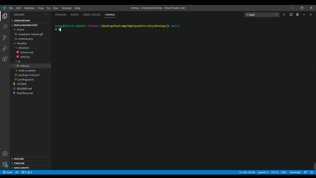
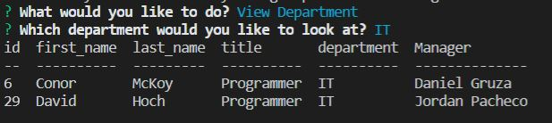
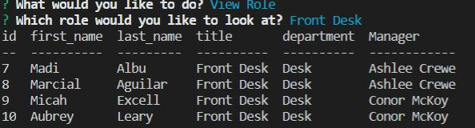
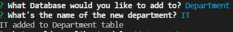
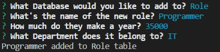
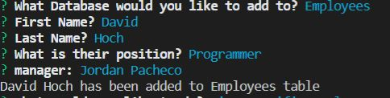

  # Employee Directory
  
  
  ## Table of Contents
  * [Description](#description)
  * [Installation](#installation)
  * [Usage](#usage)
  * [License](#license)
  * [Contribute](#contribute)
  * [Questions](#questions)
  * [Watch the Demo here](https://www.youtube.com/watch?v=Xg0gGYWbCho&feature=youtu.be)
    
  ## Description
  
 Allows managers to keep track of their employees with their roles and departments. Managers can add, delete, and update their directory to best reflect their company's structure 

  
  ## Installation
  
 Run npm install to download inquirer and MySQL. Be sure to link to your MySQL workbench 

  ## Usage
  
Managers can start using the app by running npm `index.js` in the develop/js folder. Once they have started the app, they will be presented with a list of options to choose from. One of their first options to veiw all their current employess, which will give them a table of all employees withing the database.

  
    
  
Other options for the manager to choose include viewing specific roles, departments, and employees. In the case of veiwing a department or role, the user will be prompted to choose which chosen table they would like to see and it provides the user with a table detailing all employees that fall into that category.

  
  
    
  
Once the user has gotten to their desired Role, Department, or Employee, they can either return to the main page or choose to delete their choice from the database completely. Once deleted, anything employees tied to the role or department are deleted alongside them through use of the cascading demand in MySQL.

  
    
  
When selecting a specific employee, the user may also update that employee's info to change their name or role. Once decided to update the employee, the user will be prompted with a couple question to determine what needed to be changed and what it should be changed to. Once changed the user will be returned to the main page.

  
    
  
The last thing the user can do with the app is add new departments, roles, and employees to the database. By choosing the "Add to Database" option, the user will be given a series of prompts to determine what to add to the database and specific questions according to whether the user is adding a deparment, role, or employee.

  
    
  
  

  ## License
  
 This app is covered under the MIT License 

  
  ## Contribute
  
 Contact Conor using the information below 

  ## Questions
  
 For any questions, contact me at 

  <h3> Email : </h3>
  <strong>mckoyc@gmail.com</strong>
    
  <h3> Github Account:</h3>
  
  
  [mckoyc94](https://github.com/mckoyc94)

